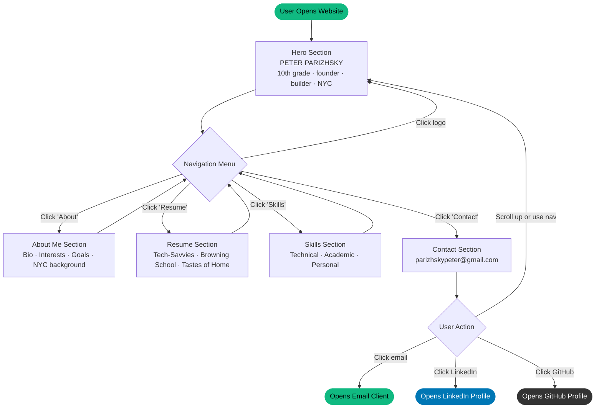

# Website Outline — Peter Parizhsky Portfolio
**Peter Parizhsky | 10th Grade | The Browning School**

---

## Front-End Plan

### Overview
Single-page website with five sections: Hero, About Me, Resume, Skills, and Contact. All sections live on one scrollable page with anchor-link navigation. No page reloads.

### Color Scheme
| Role | Color | Usage |
|---|---|---|
| Background | `#121317` (near-black) | Page background |
| Accent / Highlight | `#10b981` (green) | Labels, dashes, buttons, hover states |
| Primary Text | `#e3e2e7` (off-white) | Headings and body |
| Secondary Text | `#c7c6ca` (grey) | Subtext, nav links |
| Card Surface | `#0a0a0b` (deep black) | Resume/skill cards |

### Fonts
- **Playfair Display SC** — Display headings, logo, section titles (serif, cinematic)
- **Gelasio** — Body text, navigation labels, bullet points (readable serif)

### Special Effects
- **Film Grain Overlay** — Animated SVG noise texture at 6% opacity sits over the entire page, gives a cinematic/film feel
- **Rack Focus Animation** — Elements load blurred and slightly scaled down; on scroll they snap into sharp focus (mimics a camera rack focus)
- **Frosted Glass Nav** — Navigation bar uses `backdrop-blur` so content scrolls behind a semi-transparent bar

---

### Section Wireframes

#### Navigation Bar (Sticky — appears on every section)
```
┌─────────────────────────────────────────────────────────┐
│  PETER PARIZHSKY        ABOUT  RESUME  SKILLS  [CONTACT]│
└─────────────────────────────────────────────────────────┘
  Logo / name (top-left)   Nav links (center-right)  CTA btn
  Always visible · Frosted glass · Scrolls with page
  Mobile: hamburger (☰) replaces links → slide-down drawer
```

#### 1. Hero Section
```
┌─────────────────────────────────────────────────────────┐
│                                                         │
│          [ Cinematic architectural background image ]   │
│          [ Dark gradient overlay top + bottom + sides ] │
│                                                         │
│                   PETER PARIZHSKY                       │
│         10th grade student, founder, and builder.       │
│                    New York City.                        │
│                                                         │
│                        ↓  (bouncing arrow)              │
│                                                         │
└─────────────────────────────────────────────────────────┘
  Full viewport height · Sticky (content scrolls over it)
  Text centered · Large display font
```

#### 2. About Me Section
```
┌──────────────────────┬──────────────────────────────────┐
│                      │  About Me                        │
│   [ Photo / Image ]  │  "Building things that matter."  │
│   Grayscale filter   │                                  │
│   Thin border        │  I'm Peter Parizhsky, a 10th     │
│   Green glow blur    │  grader in NYC. I started        │
│   behind image       │  Tech-Savvies in 2020...         │
│                      │                                  │
│                      │  — Technology & Building         │
│                      │  — Gaming                        │
│                      │  — Writing & Reading             │
│                      │  — Community & Volunteering      │
│                      │                                  │
│                      │  [Goals paragraph]               │
│                      │  [NYC background paragraph]      │
└──────────────────────┴──────────────────────────────────┘
  Two-column grid (image left, text right) · Stacks on mobile
```

#### 3. Resume Section
```
┌─────────────────────────────────────────────────────────┐
│  Resume                                                 │
│  "Education & Experience"                               │
├─────────────────────────────────────────────────────────┤
│  01 / Work Experience         [ FULL WIDTH CARD ]       │
│  Tech-Savvies                                           │
│  Founder & CEO · Founded 2020, Relaunched 2026 · NYC   │
│  — Founded web dev and IT support company               │
│  — 5-day website turnarounds for local businesses       │
│  — Clients: Gunn Brook Farm, Gregory Parizhsky studio  │
│  — Manage all client communication and execution        │
├───────────────────────┬─────────────────────────────────┤
│  02 / Education       │  03 / Extracurricular           │
│  The Browning School  │  Tastes of Home Club            │
│  10th Grade           │  Co-Founder & Leader            │
│  Class of 2028        │  Feb 2026 – Present             │
│  NYC                  │                                 │
│  — Honor Roll 7th–now │  — Fight food insecurity in NYC │
│                       │  — Food drives, soup kitchens   │
│                       │  — Cultural cooking events      │
└───────────────────────┴─────────────────────────────────┘
  Dark card surfaces · Hover: subtle green glow + shimmer
  Tech-Savvies spans full width · Two half-width cards below
```

#### 4. Skills Section
```
┌───────────────────┬───────────────────┬─────────────────┐
│  Technical        │  Academic         │  Personal       │
│  ─────────────    │  ─────────────    │  ───────────    │
│  — HTML & CSS     │  — Research       │  — Entrepren.   │
│  — JavaScript     │  — Writing        │  — Leadership   │
│  — Python         │  — Analysis       │  — Client comm  │
│  — Git & GitHub   │  — Proj. mgmt     │  — Problem-slv  │
│  — AI Prompting   │  — Time mgmt      │  — Initiative   │
│  — Web Dev        │                   │  — Community    │
│  — IT Support     │                   │                 │
│  — SEO basics     │                   │                 │
│  — No-code tools  │                   │                 │
└───────────────────┴───────────────────┴─────────────────┘
  Three equal columns · Dark card per category · Stacks mobile
```

#### 5. Contact Section
```
┌─────────────────────────────────────────────────────────┐
│                                                         │
│                     Get In Touch                        │
│                                                         │
│             parizhskypeter@gmail.com                   │
│             (large, clickable, opens email)             │
│                                                         │
│                [ LinkedIn ]  [ GitHub ]                 │
│                                                         │
└─────────────────────────────────────────────────────────┘
  Dark near-black bg · Green ambient glow behind text
```

#### Footer
```
┌─────────────────────────────────────────────────────────┐
│  PETER PARIZHSKY    © 2026 All Rights Reserved    About Resume Skills │
└─────────────────────────────────────────────────────────┘
```

---

## Back-End Plan

### Architecture
This is a **static website** — one HTML file, no server, no database. Everything runs in the browser.

### Technology Stack
| Layer | Technology | Purpose |
|---|---|---|
| Structure | HTML5 (`index.html`) | Page content and layout |
| Styling | Tailwind CSS (via CDN) | All visual design; custom theme configured inline |
| Fonts | Google Fonts (via CDN) | Playfair Display SC, Gelasio |
| Icons | Material Symbols (via CDN) | Menu, arrow, and UI icons |
| Behavior | Vanilla JavaScript | Interactivity (no frameworks) |
| Hosting | GitHub Pages / Netlify | Static file hosting — no build step required |

### How the Page Functions

**1. Tailwind CSS (Styling Engine)**
The Tailwind CSS library is loaded from CDN. A custom theme config in `<script id="tailwind-config">` defines the exact color palette (Material Design 3), typography scale, spacing tokens, and border radius values used throughout the site.

**2. Scroll Animations — IntersectionObserver**
```
Every .rack-focus element starts: blurry + scaled down + invisible
When user scrolls and element enters viewport:
  → IntersectionObserver fires
  → adds class .is-visible
  → CSS transition snaps to: sharp + full size + visible
  → looks like a camera rack focus
```

**3. Staggered Card Reveals**
Cards in the Resume and Skills sections have `data-delay` attributes (e.g. `data-delay="150"`). On page load, a JavaScript loop reads these and sets `transitionDelay` inline, so cards animate in sequence rather than all at once.

**4. Mobile Navigation**
```
User taps ☰ button
  → JavaScript toggles 'hidden' class on drawer div
  → Icon swaps: menu → close
  → aria-expanded attribute updates for accessibility
User taps any nav link
  → drawer auto-closes
  → smooth scroll to target section (CSS scroll-behavior: smooth)
```

**5. Film Grain Effect**
An SVG `<feTurbulence>` filter generates procedural noise. A CSS `@keyframes grain-shift` animation shifts its position every 0.5s in 2 steps, simulating the random frame-to-frame variation of actual film grain. It sits fixed over the whole page at 6% opacity and ignores pointer events.

**6. Navigation**
All nav links are standard HTML anchor links (`href="#about"`, `href="#resume"`, etc.). CSS `scroll-behavior: smooth` and `scroll-padding-top: 88px` (nav height) handle smooth scrolling with correct offset.

### No Build Step Required
Open `index.html` directly in a browser, or deploy the single file to any static host. No npm, no bundler, no compilation needed.

---

## User Interaction Flowchart



*(See `flowchart.png` for rendered version)*
